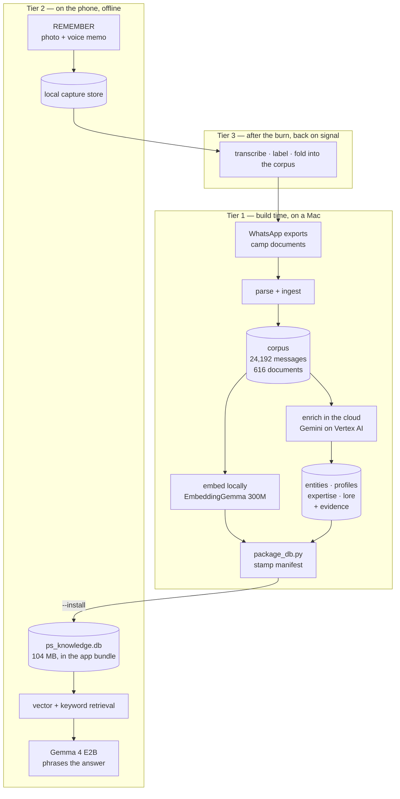

# Lucy PT — Architecture

An offline knowledge app for the Preservation Society Burning Man camp. It answers
questions about camp knowledge — where things are, how they work, who knows about
them — from ten years of WhatsApp history and camp documents, on a phone, with no
signal.

*Status as of 2026-08-20. Sections marked **planned** are designed but not built;
see [Current state](#current-state) for what actually runs today.*

---

## The constraint that shapes everything

Black Rock City has no usable network. Whatever the app can answer, it must already
be carrying. That single fact drives every decision below: the corpus ships inside
the app bundle, the models run on the phone, and nothing may depend on a request
succeeding.

The second constraint is a corollary. Because nobody can check a claim against the
internet out there, a confident wrong answer is worse than no answer. Someone acting
on "the ladders are in Boris" at 2am, in dust, is going to walk to Boris.

## The spine

> **The database answers. The model only phrases it.**

Every answer traces to a stored row, and every stored row traces to the message or
document it came from. The language model's job is to turn retrieved rows into a
sentence — never to supply a fact. This is what keeps a fluent hallucination from
reaching someone who has no way to check it.

Two mechanisms enforce it, described in [Guards](#guards): the **evidence** table
makes an unsourced claim structurally impossible, and the **manifest** makes a
mismatched retrieval index refuse to launch instead of silently returning noise.

## Three tiers

Work is pushed as early as possible. Anything that can happen on a Mac before the
burn does; the phone does as little as it can.



**Tier 1 — build time.** Parsing, embedding and enrichment all happen on a Mac.
Enrichment is the expensive part and the only part that leaves the machine: a
frontier model reads the corpus and writes derived records. It runs once per corpus
rebuild, not once per question.

**Tier 2 — on the phone.** Retrieval and phrasing. No network. The phone never runs
enrichment; it retrieves conclusions that were already drawn.

**Tier 3 — after the burn.** Captures recorded on playa are analysed when signal
returns and folded back into the corpus, so next year's build starts richer. This
closes the loop: the app both consumes and produces camp memory.

## Data model

Two layers in one SQLite file.

### Corpus (raw, ingested)

| Table | Rows | What it holds |
|---|---|---|
| `person` | 1,338 | Everyone who appears in the history |
| `person_content` | 24,192 | Individual messages, with sender and timestamp |
| `camp_knowledge` | 616 | Documents — manuals, plans, menus, insurance |
| `embeddings` | 24,175 | Message vectors (Float32 BLOB) |
| `knowledge_embeddings` | 616 | Document vectors — full coverage |
| `roster`, `shifts` | — | Legacy, contaminated, scheduled for re-sourcing |
| `meta` | 8 | The build manifest |

### Enrichment (derived)

Built by reading the corpus, never by reading itself.

| Table | What it holds |
|---|---|
| `entity` | A named thing: `vehicle`, `structure`, `tool`, `place`, `tradition`, `asset` |
| `entity_alias` | The camp calls things several names |
| `entity_fact` | **One dated fact per row**, categorised `access`/`contents`/`location`/`handling`/`history` |
| `person_profile` | Who someone is within the camp |
| `expertise` | Topic and confidence: `strong`/`moderate`/`mentioned` |
| `relationship` | `builds_with`/`chapter`/`co_shift`/`mentors` |
| `lore` | Stories worth keeping |
| `evidence` | **The spine.** Links every derived row to its source row and exact quote |

Two properties of this schema are deliberate and easy to "fix" by mistake:

**Facts are one-per-row and dated, because they contradict.** Cece checked the Doris
inventory on 19 Aug 2022 and found no ladders. Marcus saw at least three on 24 Aug.
Nobody ever reconciled it. Both rows are kept, both dated, and the UI shows both.
Collapsing them would invent an answer the camp never reached. There is intentionally
no UNIQUE constraint that would prevent this.

**A question is not a fact.** The corpus is conversation, so it is full of people
asking things. "Is this because we store ladders on Boris?" is evidence that someone
wondered, not that it is true. The enrichment prompts and the fixture both treat this
as a hard rule, and it is the failure mode the fixture exists to demonstrate.

## Guards

### Evidence — no claim without a source

Enforced in two halves, because one half is impossible on its own:

- **Source side, at insert.** The `evidence_source_exists` trigger rejects any
  evidence row whose `source_id` doesn't exist in the named table, and CHECK
  constraints restrict `source_table` and `claim_table` to real tables.
- **Claim side, at end of pass.** `verify_evidence_complete(conn)` raises if any
  claim row has no evidence. This *cannot* be a trigger: a claim row must exist
  before evidence can cite its id, so every claim is legitimately evidence-free for
  a moment. Every pass that writes claims calls it before committing.

### Manifest — no silent index mismatch

An earlier build shipped vectors of one dimension into a runtime expecting another.
Nothing failed; cosine similarity between mismatched vectors is just a number, so
every query returned confident nonsense.

`meta` now records `embedding_model`, `embedding_dim`, `schema_version`, `built_at`,
`source_commit`, and row counts. The app validates model and dimension at launch and
**refuses to start on a mismatch** — a loud failure instead of a quiet wrong answer.

The values are *measured from the stored vectors*, then checked against what the
build expects. A manifest that simply wrote its own constants would always agree with
itself and catch nothing. `package_db.py` also refuses to package if any document
lacks an embedding, checked per row rather than by comparing counts — 616 vectors
against 616 rows still passes when one row has two and another has none.

### Build over build — no silent regression

Every guard above asks whether an artifact is *internally sound*. None asked
whether it is **as good as the last one**, and on 2026-08-20 that cost a day:
the enrichment model was swapped, entity discovery fell 149 → 64, and every
gate stayed green. It was caught because somebody happened to be watching a
number scroll past.

`check_shipped_db.py` now refuses a build where any table shrank more than
25% against `scripts/build_baseline.json` — the last build a human accepted.
`--accept` moves the baseline, and it is committed, so acceptance is a diff
somebody can question rather than a state on a laptop.

A fixed floor cannot do this job. `ingest_all.py` has floors and they work,
but they are hand-set against counts nobody re-derives: a floor of 500 on a
corpus deliberately trimmed to 144 fails for the wrong reason, and it did,
twice in one day. **Floors move when the rule moves, never to make a red line
go green.**

### The acceptance gate — a case whose answer we know

`validate_extraction.py` runs one real extraction against the hand-written
Doris record and scores it: does it keep the ladder contradiction instead of
resolving it, does it refuse to turn a question into a fact, is every quote
verbatim.

It is worth reading as a cautionary tale. Until 2026-08-20 it could not have
caught anything: `MODEL` was hardcoded so it tested whatever model it was
written against, `SYSTEM` was an inline copy of a prompt that had since
diverged from the one the pipeline sends, it pinned a `person_content` id
that no rebuild preserves, and nothing invoked it. Worst of all, its most
interesting check never ran — the SQL deliberately feeds the model the
*Boris* rows as a tempting wrong answer, and a Python filter removed them all
before the model saw any. "Excludes Cece's question" passed by not asking.

It now imports `MODEL` and `client()` from `vertex_client`, reads the real
prompt file, and finds its fixture row by text. Repairing it immediately
surfaced a production bug: WhatsApp wraps an @-mention in invisible bidi
isolates, 6% of messages carry them, and `quote_verified()` was dropping
every fact that quoted across one.

## The build pipeline

```bash
cd scripts && source .venv/bin/activate

./reingest.sh          # all twelve stages, in the only order that works
```

Run `reingest.sh` rather than the passes by hand. It carries each ordering
constraint as a comment beside the step it governs, because the constraints
are not guessable and two of them are load-bearing:

- **`dedupe_people.py` before enrichment.** It deletes non-people and the
  `person_content` they wrote, and `evidence` cites `person_content` by id.
- **`embed_claims.py` after everything that writes a claim.** Partial vector
  coverage is refused at the gate, so a forgotten run fails loudly.

And one flag is: **`build_people.py --install`**. Without it the roster is
written to a file nothing downstream reads and `camp_member` stays empty —
which, combined with a `--src` default that resolved inside a git worktree
where the gitignored corpus does not live, is why the roster was absent from
every build until 2026-08-20. Both failures printed a line and carried on.

```bash
python package_db.py ./output/ps_knowledge.db --install
```

`--install` is the **only** supported way to update the shipped database. The manual
`cp` it replaced is how the dimension mismatch shipped.

**Ingestion order matters and is enforced in code.** Chat parsing rebuilds tables that
document ingestion also writes to; running them the wrong way round wipes five tables.
`ingest_all.py` owns the order and guards it with row-count floors, because putting
the order in a README is how it got broken the first time.

### Enrichment

Runs on **Gemini**, project `lucy-snails`, `location="global"`,
`gemini-3.1-pro-preview`. (The product was Vertex AI when this was written and
is now Agent Platform; `scripts/vertex_client.py` keeps its name because nine
modules import it and renaming is churn.) Structured output via
`response_schema` so the shape is guaranteed rather than parsed and retried; a
bounded thread pool rather than batch prediction, because ~650 requests don't
justify staging input through GCS.

**Pro, not Flash, and this was measured.** On 2026-08-20 the same corpus —
27,163 messages and 627 documents, byte for byte — gave 149 entities on Pro
and 64 on `gemini-3.6-flash`. The headcount understates it. Flash keeps what
you can photograph and loses what the camp *says*:

| kind | Pro | Flash |
|---|---|---|
| tradition | 70 | 24 |
| asset | 26 | 7 |
| vehicle | 12 | 11 |

The hundred names it dropped were Edd's law, Ketamine Kittens, decomrecom,
Meatany, the burn book. Enrichment reads rambling group chat and decides that
a phrase is a thing the camp has a name for; that is judgement, and capability
beats throughput on this pass.

The preview tag is not a preference. Probed 2026-08-20: `gemini-3.1-pro`,
`-3.5-pro`, `-3.6-pro` and `-3.7-pro` all 404, and the only other Pro that
serves is 2.5.

Region note: `client.models.list()` returns a catalogue, **not** an
availability list. Availability must be probed with real requests, never
inferred — and **probe results expire in weeks**. A finding from eleven days
earlier was cited as current on 2026-08-20 and was wrong. `global` is also a
property of the *model*: asking `us-central1` for 3.6 Flash 404s while the
console model card lists it as available, because access and a regional
endpoint are different questions.

### Incremental — only pay for what changed

`scripts/enrich_cache.py`, wired into `vertex_client.run_all`, the one
chokepoint all eight passes funnel through, so they became incremental
together.

1,830 of 27,163 messages were newer than 23 January — six per cent — and
every rebuild re-derived the other ninety-four. The cost was never the money:
it set the iteration loop at hours, so each question ("is Flash good enough",
"did the trim break anything") took a whole run to answer.

**Keyed by content, never by row id.** `ingest_all` recreates the database and
reassigns every autoincrement, so a row-keyed cache would return the answer
belonging to whatever message inherited that id — and look healthy doing it.
The key is sha256 over model, system prompt, schema and prompt, so a prompt
edit correctly invalidates everything. Failures are never cached, or a
transient 5xx would become a permanent hole. `LUCY_NO_CACHE=1` forces cold.

Voice: first person plural. Lucy belongs to the camp — "our bike fleet", not
"the camp's bike fleet". Quoted evidence is reproduced verbatim and never
rephrased.

### What gets in

`parse_docs.should_ingest()` cut 627 documents to 144 on 2026-08-20, and
entity discovery moved 149 → 138. Cutting 77% cost almost nothing, which is
the finding: **the camp's identity lives in the chat, not in the
spreadsheets.**

It splits on *shape*, not on folder or year, because three earlier rules each
deleted something load-bearing — "drop finance" took the only document
containing "tourniquet" (a med kit inventory, filed under finance because
`categorize_file()` reads the path); "drop food before 2022" took a recipe
binder; "drop shifts" took prose about how the camp runs. An inventory says
what the camp has and answers questions; a ledger says what it paid and does
not.

Decided by an **orphan-term test**: a document is safe to drop only when every
distinctive word in it appears somewhere in the kept set. It is a *skip rule* —
every file stays in `PS Processed/`, so cutting too deep costs one line.

Voice: first person plural. Lucy belongs to the camp — "our bike fleet", not "the
camp's bike fleet". Quoted evidence is reproduced verbatim and never rephrased.

## On the phone

| Piece | Choice | Why |
|---|---|---|
| Inference | **llama.cpp**, pinned at tag `b10333` | Direct control; iOS min 16.4 |
| Generation | **Gemma 4 E2B** Q4_K_M (3.11 GB) + `mmproj-F16` (986 MB) | 128K context, vision-capable |
| Embedding | **EmbeddingGemma 300M** Q8_0 (334 MB), 768-dim | Same model as build time — non-negotiable |
| Storage | SQLite via SQLite.swift | The corpus is already a database |

Target hardware is iPhone 15 Pro or newer. There are deliberately **no device
tiers** — supporting everyone would compromise the design for a camp that all
carries recent phones.

**Apple Foundation Models were evaluated and rejected**: no streaming, and a
4096-token context that can't hold retrieved evidence plus a question.

**The open risk** is resident memory: roughly 4 GB of weights against an 8 GB phone's
jetsam limit. `docs/superpowers/plans/2026-08-09-memory-spike.md` exists to answer
this on real hardware before anything is built on top of it. The simulator's memory
behaviour proves nothing.

## Two modes

**ASK** — retrieve what the camp already knows. Answers are entity records, not
message snippets. An earlier attempt returned the three chat messages that embedded
nearest the query, which is how you learn that retrieval and *answering* are different
problems.

**REMEMBER** — capture a photo and a voice memo now; analysis happens after the burn.
Recording must work when you are dusty, gloved, and in a hurry, so it has no network
dependency and no analysis step on the critical path.

The modes are shape-coded — ASK a circle, REMEMBER a square, equal footprints — so
they're distinguishable in dust and at night. Day and night palettes are separate:
`#DFE2DB` cool alkali dust for daylight, `#07080A` with amber `#FF9A3C` for 3am.

## Repository layout

```
scripts/                    Build-time Python. Everything here runs on a Mac.
  ingest_all.py             Orchestrates ingestion; owns the order
  parse_chats.py            WhatsApp exports -> messages
  parse_docs.py             Documents -> camp_knowledge
  embed_corpus.py           EmbeddingGemma over the corpus
  enrich_schema.py          Enrichment tables, triggers, evidence audit
  build_fixture.py          Hand-written fixture (see below)
  package_db.py             Manifest + install
  tests/                    pytest, 46 tests

Lucy/                       The SwiftUI app; Xcode project generated from project.yml
  Retrieval.swift           Picks the rows
  LucyVoice.swift           Composes them into the fact sheet
  LucyBrain.swift           The prompt, and the register and length dials
  LlamaHandle.swift         llama.cpp; decides the turn markers by tokenising
  EntityStore.swift, PeopleStore.swift, AnswerStore.swift   SQLite readers
  Sync.swift                The camp server round trip
  Tests/                    XCTest; UITests/ drives the device
  (enriched_preview.db is bundled from scripts/output/ — generated, git-ignored)

SnailsNative/vendor/        Pinned llama.cpp and the xcframework build script
backend/                    The camp server (FastAPI, Postgres, Caddy)
evals/                      Questions and goldens for the regression gate
site/                       Install page and the public /tech write-up
deploy/                     VM, push, App Store Connect helpers

ARCHITECTURE.md             This file
docs/
  learnings-lucy-*.md       What went wrong, dated
  design/                   Design prototypes
  superpowers/specs/        Decision records
  superpowers/plans/        Implementation plans
```

### The fixture

`scripts/build_fixture.py` builds a small database of **hand-written** entity records
in the real schema, sourced from real corpus rows: 3 entities, 21 dated facts,
58 evidence rows. It has two jobs.

It lets the app be built against real-shaped data before the enrichment pipeline
exists — the first UI attempt was designed against imagined data and had to be thrown
away. And it is the **acceptance target** for enrichment: the test isn't "did Gemini
return valid JSON", it's "are these records as good as the ones a human wrote from
the same messages".

## Invariants

Rules that have each already been broken once, or would be expensive to break.

1. **Never mutate the shipped database by hand.** `build_preview_db.py` writes
   `scripts/output/enriched_preview.db` and `check_shipped_db.py` gates it; that
   is the only path. A manual `cp` once shipped a dimension mismatch.
2. **Never commit corpus content.** `Whatsapp PS Exports/`, `PS Processed/`,
   `scripts/output/`, `scripts/models/` are git-ignored. The corpus names 1,338 real
   people and came within one `git add -A` of being committed.
3. **The embedding model must match between build and runtime.** Different model or
   dimension means silently meaningless similarity scores.
4. **Every derived claim carries evidence.** Enforced by trigger and by
   `verify_evidence_complete` at the end of every pass.
5. **Contradictions are preserved, never resolved.**
6. **A question is never recorded as a fact.**
7. **Availability is probed, not inferred** — for models, and for anything else where
   a catalogue and reality can disagree.

## Current state

*2026-08-20.*

| Component | State |
|---|---|
| Corpus ingestion + parsing | **Built.** 27,163 messages from ten WhatsApp groups, Sept 2020 to yesterday |
| Documents | **Built.** 144, cut from 627 — see [What gets in](#what-gets-in) |
| Roster | **Built 2026-08-20.** 291 people across seven sign-up sheets, 2016–2026. Absent from every previous build |
| Enrichment pipeline | **Built.** Twelve stages, ~650 requests, `reingest.sh` |
| Incremental cache | **Built 2026-08-20.** Content-keyed; a rebuild now pays only for what changed |
| Semantic retrieval (E7) | **Built.** EmbeddingGemma 300M, 768-dim vectors over the claim layer |
| Evidence guards | **Built.** Trigger, CHECK constraints, `verify_evidence_complete` |
| Build-over-build gate | **Built 2026-08-20.** Refuses a >25% shrink against the accepted baseline |
| Shifts rota | **Built 2026-08-20.** `shift_grid` + `RotaView`, display-only by design |
| Camp manual + schedule | **Built.** Info tab, read as documents rather than answered from |
| Sync to the camp server | **Built.** Round trip verified on device 2026-08-10 |
| Voice fine-tune | **Dataset builder written, never run.** Gemma 4 E2B is PEFT-only on the platform; artifacts export as safetensors |
| Two-mode UI | **Shipping** |
| Post-burn ingest (Tier 3) | **Not started** |
| Photo corpus | **Deferred.** Needs a Google Takeout export |

### Known debt

- **`SnailsNative/Snails/Package.swift` still depends on the RunAnywhere SDK.**
  It exposes no embedding capability, pins an older llama.cpp (`b7199`), and
  its build is unreproducible. Not yet done.
- **The `shifts` table is legacy.** `shift_grid` replaced it on 2026-08-20 by
  reading the sign-up sheet as the 2-D grid it actually is. The old table
  survives with ~26 rows and nothing reads it; the 2,140-row version, of which
  1,341 came from grocery lists and Venmo statements, is gone.
- **Three tables declare `email` and `phone`; one holds them.** `roster` has
  740 emails, `camp_member` is blanked on the way to the device, and
  `person.email` / `person.phone` have never been populated. Dead columns.
- **No 429 handling worth the name.** `vertex_client._one` retries three times
  at 1s and 2s with no jitter and no `Retry-After`, sleeping inside the worker
  so it holds a pool slot. A rate-limited job then degrades to `None`,
  `run_all` prints a WARNING, and the pass commits partial results and exits
  zero. Raising `MAX_WORKERS` without fixing this converts a quota event into
  a quietly incomplete corpus.
- **`MAX_WORKERS = 8` was never measured** against the real quota — and the
  global endpoint has its own, under the `..._global` metrics, so a reading
  taken against a region says nothing.
- **Legacy scripts** from January remain alongside current ones:
  `generate_embeddings.py`, `embed_knowledge.py`. `embed_corpus.py` supersedes
  both.
- **`SnailsNative/README.md` described the RunAnywhere-era app.** Rewritten
  for the public release to cover only what is still used: the vendored
  llama.cpp build and the memory spike.
